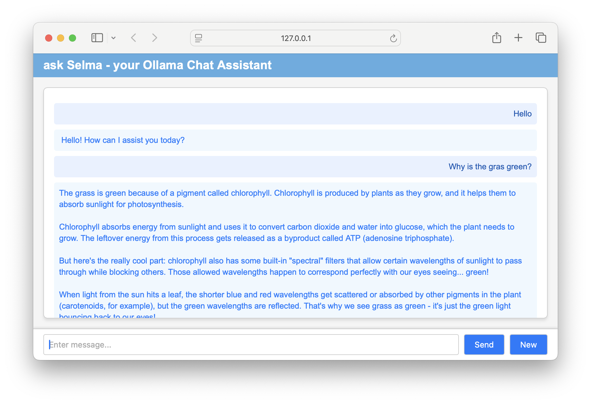
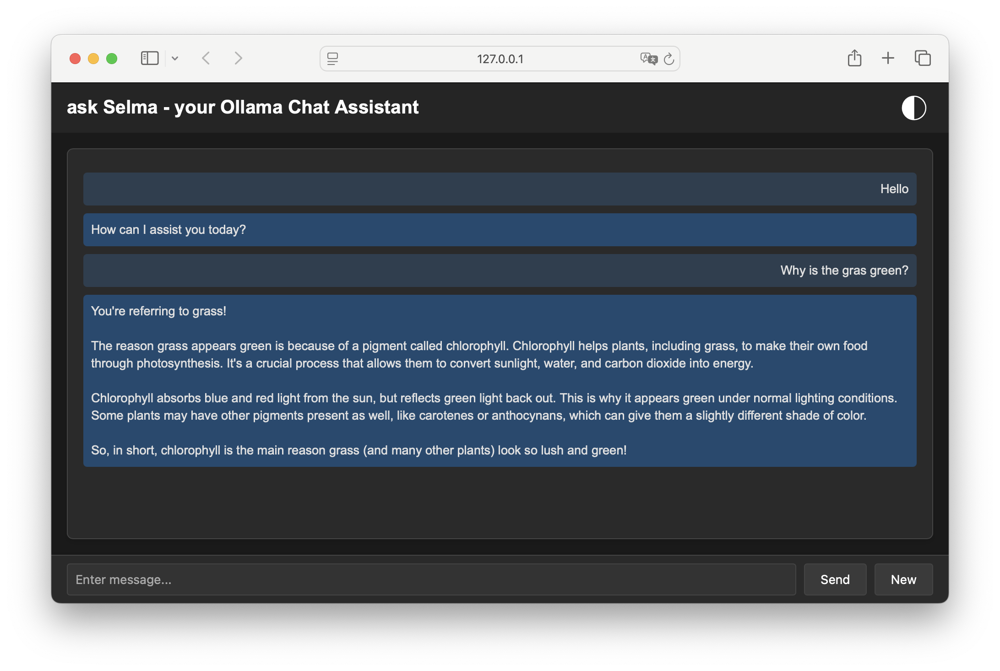

# Ask Selma - A Simple HTML GUI for Ollama

[Ollama](https://ollama.com) is great as a free local chat solution, but sometimes you need an extremely simple interface.

The solution: **Ask Selma** consists of just a single HTML page **index.html** - that's it!





You don't need any additional libraries. The HTML server can work without internet access,  
which can be necessary in some companies for security reasons.


## Features
* Only HTML, CSS, and JavaScript
* **Only one** file
* **No** CSS or JavaScript libraries
* **One-file** copy installation

## Installation
Simply copy the index.html file.

## Configuration
There are only a few parameters you can easily modify in the index.html file:

```javascript
const CHAT_TITLE = "ask Selma - your Ollama Chat Assistant";
const CHAT_MODEL = "llama3"
const OLLAMA_PATH = "http://localhost:11434"
const DARK_MODE = false;
const SHOW_NOTE_APP = false;
const MODEL_SELECTABLE = true;
```

## Support
If you would like to support this project, I would greatly appreciate it.